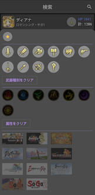
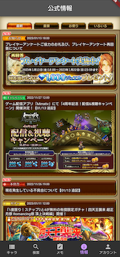
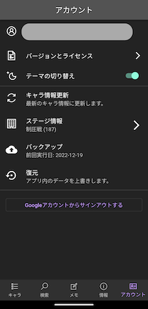

# MyRS
Flutter学習用として定期的にいじっているロマサガRSのステータス管理用アプリです。  
アイコンは著作権があるのでGit管理対象にはしていません。  

# 設計
自分がAndroidアプリ開発に慣れていることもありAACのMVVMをベースにしています。  
状態管理はRiverpodで行っておりhooksは使っていません。  

<hooksを使っていない理由>  
単にHookWidgetをextendsするのが嫌だったのでhook使ってなかったのですが、Riverpodv1.0.0でConsumerWidgetをextendsしないといけなくなったので、私の中でもはやhooksを使わない理由がなくなりました。  
近いうちにhooksを使う可能性が高いです。  

<Riverpodの使い方>  
DIとして使っている箇所は、全てref.readでProvider同士を参照しています。これは公式のMarvelアプリでも同じようにしていたので問題ないはず。多分・・  
状態管理として使っている箇所は、ViewModelやModelクラスで持っている値を読むときはwatch, 関数を呼ぶ場合はreadとしています。ただ、これがRiverPodの使い方として正しいのかはかなり疑問です。  
readは値の更新を検知しないのでなるべくwatchを使うように公式で書いているので一律readを使わないほうがいい、という言い方はしていない気がするのですが自信はありません。  
そのため、必要に応じて適宜使い方は修正していこうと思います。  

# Firebaseについて
Firebaseで利用しているサービスは次の通りです。
  - Authentication
    - Googleアカウントと連携しています。サインイン状態だと入力したキャラデータのバックアップと復元ができるようになります。
  - Storage
    - キャラ情報やお便りなど定期で更新されるデータをjsonで持っています。
  - Firestore
    - 自身で入力したステータス情報のバックアップと復元に使います。
  - Crashlytics
# 環境
実際に使っているアプリとデバッグ用のアプリはBuildTypeで分割しています。  
キャラデータが全て入ったjsonをいちいち読み込んで動作確認するのが辛かったため、動作確認は`main_dev.dart`で開発用のjsonを読み込むようにしています。  
開発はvscodeでやっているので`launch.json`のprogramにこのdartファイルを指定してデバッグしています。  
実際に個人端末で利用しているアプリは次のコマンドで作っています。  
`flutter build apk --split-per-abi --release`

# 画面イメージ一部
このイメージはver1のものなので差し替えます  

