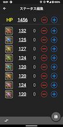
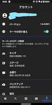

# MyRS
Flutter学習用として定期的にいじっているロマサガRSのステータス管理用アプリです。
アイコンは著作権があるのでGit管理対象にはしていません。
また、キャラ情報やお便り情報などFirebase側に持っているデータがいくつかあります。

# 作成にあたって
Firebaseを利用しています。  
  - Authentication
    - Googleアカウントと連携しています。サインイン状態だと入力したキャラデータのバックアップと復元ができるようになります。
  - Storage
    - キャラ情報やお便りなど定期で更新されるデータをjsonで持っています。
  - Firestore
    - 自身で入力したステータス情報のバックアップと復元に使います。
  - Crashlytics

また、Flutterのみで完結させたいので極力ネイティブコードには手を入れない方針にしています。

# 設計
自分がAndroidアプリ開発に慣れていることもありAACのMVVMをベースにしています。
状態管理はRiverpodで行っておりhooksは使っていません。

# 環境
実際に使っているアプリとデバッグ用のアプリはBuildTypeで分割しています。  
キャラデータが全て入ったjsonをいちいち読み込んで動作確認するのが辛かったため、動作確認は`main_dev.dart`で開発用のjsonを読み込むようにしています。  
開発はvscodeでやっているので`launch.json`のprogramにこのdartファイルを指定してデバッグしています。  
実際に個人端末で利用しているアプリは次のコマンドで作っています。
`flutter build apk --split-per-abi --release`

# 画面イメージ一部
このイメージはver1のものなので差し替える  

