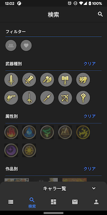

# MyRS
Flutter学習用としてロマサガRSのステータス管理用アプリを作成しています。
アイコンなどの画像ファイルは著作権もありますので一切Git管理していません。

# 概要
本アプリはFirebaseを利用しています。AuthenticationでGoogleアカウントと連携可能にしています。
ログインするとデータのバックアップと復元ができるようになっています。
その他利用しているFirebaseのサービスは以下の通りです。
  - Firebase Authentication
  - Firebase Storage
  - Firebase Firestore
  - Firebase Crashlytics

# 作成にあたっての方針
  - Flutterのみで完結させ、極力ネイティブコードには手を入れない
  - ネットワーク通信は最低限とする

電車などで素早く起動し閲覧したかったので、ネットワーク通信はアカウント画面の各機能と一部の画像ロード時のみとしています。  
画像は全部アプリに埋め込む手もあったのですが、スタイル画像やお便りは都度アプリを更新するのが面倒臭かったのでなるべくキャッシュする方針にしてネットワークから取得するようにしました。

# 設計
自分がAndroidアプリ開発を生業としている関係で`Android Architecture Components`でのMVVMの知識をベースにしています。
状態管理はRiverpodで行っています。（ここv2を一通り作ったら書き足す）
`flutter pub run build_runner build`

# 環境
実際に使っているアプリとデバッグ用のアプリはAndroidのみ分割しておりProductFlavorの設定をしています。  
動作確認はAndroid Studioのmain.dart実行時のConfiguration設定で「Build flavor:」に"develop"を指定して行い、実際に個人端末で利用しているアプリは次のコマンドで作っています。
`flutter build apk --split-per-abi -t lib/romasaga/main.dart --release`

# 画面イメージ一部
  

  

  

