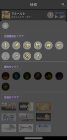

# MyRS
Flutter学習用として定期的にいじっているロマサガRSのステータス管理用アプリです。
アイコンは著作権があるのでGit管理対象にはしていません。

# 設計
自分がAndroidアプリ開発に慣れていることもありAACのMVVMをベースにしています。
状態管理は`Riverpod`で行っており`hooks`は使っていません。

## hooksを使っていない理由
単にHookWidgetを`extends`するのが嫌だったのでhook使ってなかったのですが、`Riverpodv1.0.0`で`ConsumerWidget`を`extends`しないといけなくなったので、私の中でもはやhooksを使わない理由がなくなりました。
ただ、`hooks`も`useProvider`がなくなって書き方が同じようになったので使うかどうかは微妙です。

## Riverpodの使い方
DIとして使っている箇所は全て`ref.read`で`Provider`同士を参照しています。これは公式のMarvelアプリでも同じようにしていたので問題ないと思います。
ただ、色々と勘違いしていたのでリファクタリングしました。現在の作りだと各Pageの一番上で`uiState`を`watch`してしまっているのと`ViewModel`に状態を持ってしまっているので`read`と`watch`の利用区分けは意味をなしていませんでした。そのため、Widgetが`watch`する状態は基本`StateProvider`か`StateNotifierProvider`に切り出しました。  

## 迷っているところ
前Pageから引き継ぐデータをどうするか迷っており、現在は`ViewModel`に`init`メソッドをつけて`ViewModel`のフィールドとして持っています。  
ほとんどの場合、そういった前画面から受け取ったデータをもとにしたものを`Provider`で状態管理したいのですがその場合の設計で以下の３パターン思いつきました。
1. 引き継いだデータを`Provider`で持つ
   1. この場合、ページに遷移してきた際に100%データが存在するにもかかわらず`Provider`の型はnull許容しないといけないので、いちいち!をつけるのが嫌だなと思いました
2. 引き継いだデータは`ViewModel`で持つ
   1. 現在これでコード書いてます。これだと各`Provider`の値をいちいち`ViewModel`で初期設定しないといけないので嫌だなと思いました。（本当は1のように1つの`Provider`に値を入れたら他の`Provider`は`watch`して勝手に最適なデータが流れてほしい）
3. 引き継ごうとするデータも`Provider`にする
   1. Page間やりとりも全部`Provider`でやればいいのでは？と思ったのですが、ページ遷移する際に「AとBの`Provider`に結果を入れてく必要がある」といちいち遷移時に考えないといけなくなるのはすごく嫌だなと思いました。
   2. これをやるなら全てのデータを`Provider`でやり取りするのがいいと思いますが（全ての`Provider`が相互作用すればページ遷移する際にXXの`Provider`に値が入っていない、というミスは無くなるのかなと）これをそのままやるとView層を巻き込んで`Provider`が複雑に絡み合ってしまうと思って躊躇しています。もしやるならPageごとに`Provider`を束ねる`Provider`を作るのが望ましいと思いましたがその場合はUI層の再検討が必要でした。

この問題は`character_detail_view_model.dart`がわかりやすいと思いますが、できることなら`ViewModel`で持っている`_character`や`_stage`は`Provider`にしたいと思っています。
現在の緩いMVVM設計は私が分かりやすいので基本は1画面1ViewModel(`ChangeNotiferProvider`)でいきたいと思っていますが、上記のような疑問が出るのはそもそも`Riverpod`を理解していない可能性も大きいので、どういう作りがベストなのかは模索中です。  

# Firebaseについて
Firebaseで利用しているサービスは次の通りです。
  - Authentication
    - Googleアカウントと連携しています。サインイン状態だと入力したキャラデータのバックアップと復元ができるようになります。
  - Storage
    - キャラ情報やお便りなど定期で更新されるデータをjsonで持っています。
  - Firestore
    - 自身で入力したステータス情報のバックアップと復元に使います。
  - Crashlytics
    - クラッシュレポート
# 環境
実際に使っているアプリとデバッグ用のアプリはBuildTypeで分割しています。
キャラデータが全て入ったjsonをいちいち読み込んで動作確認するのが辛かったため、動作確認は`main_dev.dart`で開発用のjsonを読み込むようにしています。
開発はvscodeでやっているので`launch.json`のprogramにこのdartファイルを指定してデバッグしています。

# 画面イメージ一部

